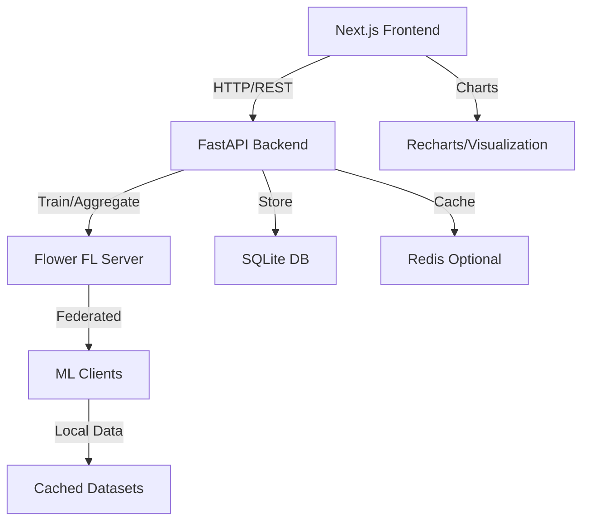

# TGFL Project Architecture

## Overview

This document outlines the architecture and project structure for the Transformer-Based Generative Federated Learning Market Scenario Simulator MVP.

## System Architecture



## Directory Structure

```
tgfl-market-simulator/
├── README.md                    # Project overview and setup
├── docs/                        # Documentation
│   ├── architecture.md          # This file
│   ├── api-spec.md             # API documentation
│   └── demo-script.md          # Demo presentation script
├── web/                        # Next.js Frontend (TypeScript)
│   ├── app/                    # App Router structure
│   │   ├── layout.tsx          # Root layout
│   │   ├── page.tsx            # Dashboard home
│   │   ├── providers.tsx       # React Query provider
│   │   ├── train/              # Training pages
│   │   └── scenarios/          # Scenario pages
│   ├── components/             # Reusable UI components
│   │   ├── ui/                 # shadcn/ui components
│   │   ├── charts/             # Chart components
│   │   └── forms/              # Form components
│   ├── lib/                    # Utilities and configs
│   │   ├── api.ts              # API client
│   │   ├── utils.ts            # Helper functions
│   │   └── store.ts            # Zustand store
│   ├── hooks/                  # Custom React hooks
│   └── styles/                 # Global styles
├── api/                        # FastAPI Backend (Python)
│   ├── main.py                 # FastAPI app entry
│   ├── config.py               # Configuration
│   ├── models/                 # Database models
│   ├── routers/                # API route handlers
│   │   ├── training.py         # Training endpoints
│   │   ├── scenarios.py        # Scenario endpoints
│   │   └── health.py           # Health/status endpoints
│   ├── services/               # Business logic
│   │   ├── fl_service.py       # Federated learning orchestration
│   │   ├── model_service.py    # Model management
│   │   └── data_service.py     # Data processing
│   └── tests/                  # API tests
├── ml/                         # Machine Learning Components
│   ├── notebooks/              # Jupyter notebooks for exploration
│   │   ├── 01_data_exploration.ipynb
│   │   ├── 02_baseline_model.ipynb
│   │   └── 03_federated_training.ipynb
│   ├── models/                 # Model definitions
│   │   ├── transformer.py      # Lightweight transformer
│   │   └── baseline.py         # Baseline models
│   ├── federated/              # Federated learning logic
│   │   ├── client.py           # FL client implementation
│   │   ├── server.py           # FL server/aggregation
│   │   └── strategies.py       # Aggregation strategies
│   ├── data/                   # Data processing utilities
│   │   ├── loaders.py          # Data loading
│   │   ├── synthetic.py        # Synthetic data generation
│   │   └── preprocessing.py    # Data preprocessing
│   └── evaluation/             # Model evaluation
│       ├── metrics.py          # Evaluation metrics
│       └── visualization.py    # Result visualization
├── shared/                     # Shared schemas and types
│   ├── schemas.py              # Pydantic models
│   └── types.ts                # TypeScript types
├── data/                       # Data storage
│   ├── cache/                  # Cached datasets
│   ├── models/                 # Saved model checkpoints
│   └── results/                # Training results
└── scripts/                    # Utility scripts
    ├── setup.py                # Environment setup
    ├── download_data.py        # Data download script
    └── run_demo.py             # Demo automation
```

## Technology Stack

### Frontend (TypeScript)

- **Framework**: Next.js 14 (App Router)
- **State**: Zustand (global), React Query (server state)
- **UI**: shadcn/ui + Radix UI + Tailwind CSS
- **Forms**: React Hook Form + Zod validation
- **Charts**: Recharts or Chart.js
- **URL State**: nuqs

### Backend (Python)

- **Framework**: FastAPI
- **Database**: SQLite + SQLModel (development), PostgreSQL (production)
- **Validation**: Pydantic v2
- **Async**: asyncio, aiofiles, httpx
- **Caching**: Redis (optional)

### Machine Learning (Python)

- **Framework**: PyTorch (CPU optimized)
- **Federated Learning**: Flower
- **Data**: pandas, numpy, yfinance
- **Evaluation**: scikit-learn, scipy.stats
- **Visualization**: matplotlib, seaborn

## Data Flow

### Training Flow

1. User submits training request via UI
2. API validates request and queues training job
3. Background worker starts Flower FL server
4. FL clients simulate training on partitioned data
5. Server aggregates client updates (FedAvg)
6. Progress/metrics streamed back to UI
7. Final model saved with evaluation results

### Scenario Generation Flow

1. User configures scenario parameters
2. API loads trained model checkpoint
3. Model generates scenarios based on regime
4. Statistical evaluation (KS-test, ACF, etc.)
5. Results returned with visualization data
6. User can export scenarios as CSV

## Key Design Decisions

### CPU-Only Training

- Model size limited to <1M parameters
- Sequence length ≤256 tokens
- Batch size optimized for 8GB RAM
- Precomputed artifacts for demo reliability

### Local-First Approach

- SQLite for simplicity and zero-cost deployment
- Optional Redis for caching
- File-based model checkpoints
- Local data caching to avoid API dependencies

### Privacy-by-Design Simulation

- Simulated FL clients on single machine
- Data partitioning mimics real federated setup
- No actual data sharing between "clients"
- Demonstrates privacy-preserving concepts

## Success Metrics

### Technical Metrics

- **Primary**: KS-test p-value ≥ 0.05 vs historical data
- **Secondary**: ACF similarity, volatility clustering
- **Performance**: Training completes in <10 minutes
- **Reliability**: Demo runs without errors

### User Experience

- **Responsiveness**: UI updates in real-time during training
- **Clarity**: Charts and metrics are interpretable
- **Export**: Generated scenarios downloadable as CSV
- **Documentation**: Clear setup and usage instructions

## Deployment Strategy

### Development

- Local development with hot reload
- SQLite database for simplicity
- Mock data for consistent testing

### Demo/Presentation

- Local-first with precomputed artifacts
- Optional Streamlit Cloud backup
- Scripted demo flow for reliability

### Future Production

- Vercel (frontend) + Railway/Render (backend)
- PostgreSQL database
- Redis for caching and session management
- Real federated deployment with multiple institutions
